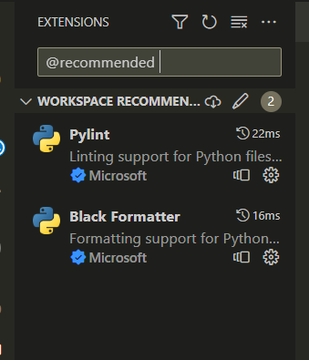

<!-- omit in toc -->
# Contributing to til-page-builder

First off, thanks for taking the time to contribute! ❤️

All types of contributions are encouraged and valued. See the [Table of Contents](#table-of-contents) for different ways to help and details about how this project handles them. Please make sure to read the relevant section before making your contribution. It will make it a lot easier for us maintainers and smooth out the experience for all involved. The community looks forward to your contributions. 🎉

> And if you like the project, but just don't have time to contribute, that's fine. There are other easy ways to support the project and show your appreciation, which we would also be very happy about:
> - Star the project
> - Tweet about it
> - Refer this project in your project's readme
> - Mention the project at local meetups and tell your friends/colleagues

<!-- omit in toc -->
## Table of Contents

- [I Have a Question](#i-have-a-question)
- [I Want To Contribute](#i-want-to-contribute)
- [Reporting Bugs](#reporting-bugs)
- [Suggesting Enhancements](#suggesting-enhancements)
- [Your First Code Contribution](#your-first-code-contribution)
- [Styleguides](#styleguides)
- [Testing Standards](#testing-standards)


## I Have a Question

> If you want to ask a question, we assume that you have read the available [Documentation](https://github.com/Amnish04/til-page-builder/blob/master/README.md).

Before you ask a question, it is best to search for existing [Issues](https://github.com/Amnish04/til-page-builder/issues) that might help you. In case you have found a suitable issue and still need clarification, you can write your question in this issue. It is also advisable to search the internet for answers first.

If you then still feel the need to ask a question and need clarification, we recommend the following:

- Open an [Issue](https://github.com/Amnish04/til-page-builder/issues/new).
- Provide as much context as you can about what you're running into.
- Provide project and platform versions (nodejs, npm, etc), depending on what seems relevant.

We will then take care of the issue as soon as possible.

<!--
You might want to create a separate issue tag for questions and include it in this description. People should then tag their issues accordingly.

Depending on how large the project is, you may want to outsource the questioning, e.g. to Stack Overflow or Gitter. You may add additional contact and information possibilities:
- IRC
- Slack
- Gitter
- Stack Overflow tag
- Blog
- FAQ
- Roadmap
- E-Mail List
- Forum
-->

## I Want To Contribute

> ### Legal Notice <!-- omit in toc -->
> When contributing to this project, you must agree that you have authored 100% of the content, that you have the necessary rights to the content and that the content you contribute may be provided under the project license.

### Reporting Bugs

<!-- omit in toc -->
#### Before Submitting a Bug Report

A good bug report shouldn't leave others needing to chase you up for more information. Therefore, we ask you to investigate carefully, collect information and describe the issue in detail in your report. Please complete the following steps in advance to help us fix any potential bug as fast as possible.

- Make sure that you are using the latest version.
- Determine if your bug is really a bug and not an error on your side e.g. using incompatible environment components/versions (Make sure that you have read the [documentation](https://github.com/Amnish04/til-page-builder/blob/master/README.md). If you are looking for support, you might want to check [this section](#i-have-a-question)).
- Also make sure to search the internet (including Stack Overflow) to see if users outside of the GitHub community have discussed the issue.
- Collect information about the bug:
- Stack trace (Traceback)
- OS, Platform and Version (Windows, Linux, macOS, x86, ARM)
- Version of the interpreter, compiler, SDK, runtime environment, package manager, depending on what seems relevant.
- Possibly your input and the output
- Can you reliably reproduce the issue? And can you also reproduce it with older versions?

<!-- omit in toc -->
#### How Do I Submit a Good Bug Report?

> You must never report security related issues, vulnerabilities or bugs including sensitive information to the issue tracker, or elsewhere in public. Instead sensitive bugs must be sent by email to <amnishsingh04@gmail.com>.
<!-- You may add a PGP key to allow the messages to be sent encrypted as well. -->

We use GitHub issues to track bugs and errors. If you run into an issue with the project:

- Open an [Issue](https://github.com/Amnish04/til-page-builder/issues/new). (Since we can't be sure at this point whether it is a bug or not, we ask you not to talk about a bug yet and not to label the issue.)
- Explain the behavior you would expect and the actual behavior.
- Please provide as much context as possible and describe the *reproduction steps* that someone else can follow to recreate the issue on their own. This usually includes your code. For good bug reports you should isolate the problem and create a reduced test case.
- Provide the information you collected in the previous section.

Once it's filed:

- The project team will label the issue accordingly.
- A team member will try to reproduce the issue with your provided steps. If there are no reproduction steps or no obvious way to reproduce the issue, the team will ask you for those steps and mark the issue as `needs-repro`. Bugs with the `needs-repro` tag will not be addressed until they are reproduced.
- If the team is able to reproduce the issue, it will be marked `needs-fix`, as well as possibly other tags (such as `critical`), and the issue will be left to be [implemented by someone](#your-first-code-contribution).

<!-- You might want to create an issue template for bugs and errors that can be used as a guide and that defines the structure of the information to be included. If you do so, reference it here in the description. -->


### Suggesting Enhancements

This section guides you through submitting an enhancement suggestion for til-page-builder, **including completely new features and minor improvements to existing functionality**. Following these guidelines will help maintainers and the community to understand your suggestion and find related suggestions.

<!-- omit in toc -->
#### Before Submitting an Enhancement

- Make sure that you are using the latest version.
- Read the [documentation](https://github.com/Amnish04/til-page-builder/blob/master/README.md) carefully and find out if the functionality is already covered, maybe by an individual configuration.
- Perform a [search](https://github.com/Amnish04/til-page-builder/issues) to see if the enhancement has already been suggested. If it has, add a comment to the existing issue instead of opening a new one.
- Find out whether your idea fits with the scope and aims of the project. It's up to you to make a strong case to convince the project's developers of the merits of this feature. Keep in mind that we want features that will be useful to the majority of our users and not just a small subset. If you're just targeting a minority of users, consider writing an add-on/plugin library.

<!-- omit in toc -->
#### How Do I Submit a Good Enhancement Suggestion?

Enhancement suggestions are tracked as [GitHub issues](https://github.com/Amnish04/til-page-builder/issues).

- Use a **clear and descriptive title** for the issue to identify the suggestion.
- Provide a **step-by-step description of the suggested enhancement** in as many details as possible.
- **Describe the current behavior** and **explain which behavior you expected to see instead** and why. At this point you can also tell which alternatives do not work for you.
- You may want to **include screenshots and animated GIFs** which help you demonstrate the steps or point out the part which the suggestion is related to. You can use [this tool](https://www.cockos.com/licecap/) to record GIFs on macOS and Windows, and [this tool](https://github.com/colinkeenan/silentcast) or [this tool](https://github.com/GNOME/byzanz) on Linux. <!-- this should only be included if the project has a GUI -->
- **Explain why this enhancement would be useful** to most til-page-builder users. You may also want to point out the other projects that solved it better and which could serve as inspiration.

<!-- You might want to create an issue template for enhancement suggestions that can be used as a guide and that defines the structure of the information to be included. If you do so, reference it here in the description. -->

### Your First Code Contribution

You'll need to have the following requirements installed on your computer to be able to run this project.

#### Project Requirements 💻

**1. Python**

This tool requires Python 3 interpreter to be installed on user's system and added to the `PATH` system variable so that python files can be easily executed from the terminal.

**2. Packages**

This project only uses 1 external library that you need to install a package from PyPi called `yattag`
```
pip install yattag
```

Alternatively, all the dependencies used by project that need to be installed are configured in the `requirements.txt` file included in the project.

The following command installs all the dependencies configured in the requirements.txt file with corresponding versions.
```
pip install -r requirements.txt
```

#### How to Run

You need to execute the entry point of the application `src/til-builder_main.py` with required positional arguments to run this tool.

Here's the syntax:
```
python src/til-builder_main.py <source file/folder> [OPTIONS]
```


<!-- ### Improving The Documentation -->
<!-- TODO
Updating, improving and correcting the documentation

-->

## Installing Recommended Extenstions

When you open the project for the first time, you'll see a popup asking you to insall recommended extensions. You should install the suggested extensions as they'll be usefull for formatting and linting your code while you're developing. This is discussed in detail in next section.

If you miss that popup, you can always go to the extensions tab and type `@recommended` to look up and install those extensions.




## Styleguides

Make sure to follow the following style standards/procedures when working on contributions.

### Code Styling

[](https://github.com/psf/black)

This project is using [black](https://github.com/psf/black) for code styling. You should have it already installed if you installed all the dependencies from `requirements.txt` file.

If not, run the following command to install black on your system.

```
pip install black
```

Now, navigate to the root directory of the project and run:

```
black .
```

This should format all the configured files in `pyproject.toml` file.

Even if you forget to run the formatter, the configured git hooks will automatically run it whenever you commit any changes.

If you're using VSCode, follow this article to integrate black into your IDE. (This is optional)

https://dev.to/adamlombard/how-to-use-the-black-python-code-formatter-in-vscode-3lo0

#### IDE Integration

If you're using VSCode, all you need to do is install the official `black-formatter` extension by Microsoft. All the necessary configurations are already set up in the project workspace settings.

### Linting

[](https://github.com/pylint-dev/pylint)

This project uses [Pylint](https://docs.pylint.org/) to enforce coding standards and prevent code smells. 

* Pylint is a static code analysis tool that checks your Python code for compliance with coding standards, style, and potential issues.
* Before submitting a pull request, please ensure that your code passes Pylint checks. This helps us maintain a high level of code quality and consistency in the project.

#### Installation

The tool should be automatically installed if you installed all the dependencies from `requirements.txt` file.

If not, the following command will install `pylint` on your system.
```
pip install pylint==<x.y.z>
```

Make sure to install the version specified in [requirements.txt](./requirements.txt)

All the **linting** settings can be found in [.pylintrc](./.pylintrc) file. 
⚠️ **Do not** make any changes to that file unless approved by the project owner.

#### Usage

Run `Pylint` on your Python code or module using the following command:

```
pylint your_module.py
```

Replace your_module.py with the name of the Python file you want to lint.

To run the tool on entire project, you need to pass the root directory in the command.
```
pylint path_to_root_directory
```

Pylint will generate a report with suggestions, warnings, and errors. Review the output to identify areas in your code that may need improvement.

Please adhere to the following guidelines when using Pylint:

* Ensure that your code does not introduce new Pylint errors or warnings.

* Address existing Pylint errors and warnings in your code before submitting a pull request.

* If you encounter Pylint issues that you believe are false positives, feel free to discuss and provide explanations in your pull request or raise the issue with the project maintainers.

#### IDE Integration

If you're using VSCode, all you need to do is install the official `pylint` extension by Microsoft. All the necessary configurations are already set up in the project workspace settings.

## Testing Standards

👨‍🔬 Tests are the **backbone** of any quality. It is an essential element in determining if the software if *progressing* in the **right direction**, instead of unexpected bugs being introduced or previous features being broken with new additions (**regression**).

This project uses [pytest](https://docs.pytest.org/en/7.4.x/) for running both [unit tests](https://en.wikipedia.org/wiki/Unit_testing) and [integration tests](https://en.wikipedia.org/wiki/Integration_testing) setup for the existing functionalities. The **unit tests** can be found in the `tests/` folder and the **integration tests** can be found in `integration/` folder.

```
pip install pytest pytest-watch pytest-cov
```

### How to run 🧪

In order to run the entire test suite, run the following command.

```
pytest
```

All the tests in the configured directories will get invoked.

If all the tests pass and you see a green status, you're good to go with the changes. Otherwise, fix the problems until all tests pass.

To rerun the tests on each save, we use the [pytest-watch](https://pypi.org/project/pytest-watch/) package.
```
ptw
```

### Coverage 📈

To check for the total coverage of codebase in the correspoding test run, we use the [pytest-cov](https://pypi.org/project/pytest-cov/) extension like so,
```
make coverage
```

or to be more explicit

```
pytest --cov=src
```

**Important:** Make sure to add both unit tests and integration tests for any new functionality you implement, necessary to prove that your features are working.

## Custom Defined Scripts 💻

Most of the utilities discussed above can be run via the custom scripts defined for this project in the **Makefile** at the root of the project. If you don't have the `make` utility already installed, you can use [Chocolatey](https://chocolatey.org/) to install in on **Windows**.

```
choco install make
```

### Makefile

To run any of the defined scripts, Run
```
make <script_name>
```

These are the scripts defined for the project.

```Makefile
install:
	pip install -r requirements.txt

format:
	black .

lint:
	pylint src/

test:
	pytest

run-failed-tests:
	pytest --last-failed 

test-watch:
	ptw

coverage:
	pytest --cov=src
```

For example, to run `black` formatter on the project, run

```
make format
```

<!-- ### Commit Messages -->


<!-- ## Join The Project Team -->
<!-- TODO -->

<!-- omit in toc -->
## Attribution
This guide is based on the **contributing-gen**. [Make your own](https://github.com/bttger/contributing-gen)!
