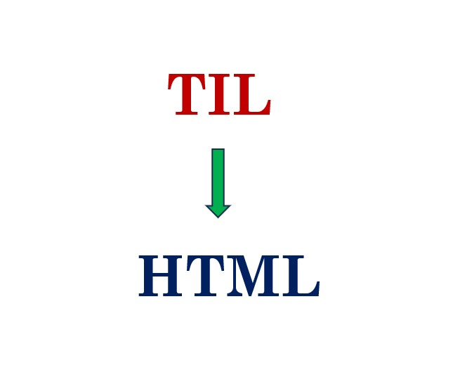

# til-page-builder

[](https://github.com/psf/black) [](https://github.com/pylint-dev/pylint)

A command-line tool for authoring "Today I Learned" posts in Markdown, which can be converted to HTML for publishing on the web.

<div align="center" style="width: 100%">
  <div style="display: flex; align-items: flex-start; justify-content: space-around;">
    
    
  </div>
</div>

## Features
Converts **text** or **markdown** files to **html** files that can be rendered as web pages.

### Common features
* Parses the first line as **web page title** and top level heading if followed by 2 empty newlines.
* Parses all **text blocks**, delimeted by an empty line, as **`p` tags** for the html.
* Generates and adds a **Table of Contents** at the top of every generated docuement for better reader experience.

### Exclusive to markdown
* Parses **headings** just like github markdown. For example, a line starting with `# ` translates to an `h1`,  `## ` to and `h2`, and so on...
* Any piece of text wrapped with `**` is converted to `strong` tag (bolded) in html, and wrapped with `*` is converted to `em` tag (italicized).

## Usage

The driver file for this tool is located at `src/til_builder_main.py`. This is the file that needs to be executed for to perform all kinds of actions that the tool supports.

### Installing the Package ⚙️

**Users** would like to install the project from [TestPyPi](https://test.pypi.org/) using
```
py -m pip install --index-url https://test.pypi.org/simple/ til-page-builder
```

Once it is successfully installed, you need to use the following command to use the tool.
```
py -m til_page_builder.til_builder_main <file/folder path> [OPTIONS]
```

### Default Behavior

At its core, the tool takes either a text file or a folder containing files as a positional argument and then generates corresponding html files to `./til` folder by default.

1. Converting a file

```
py -m til_page_builder.til_builder_main file.txt
```

2. Converting all files within a folder

```
py -m til_page_builder.til_builder_main <folder path>
```

### Flags/Options for custom behavior

Here are some examples demonstrating usage of custom flags supported by the tool.

1. `-v` or `--version` : Displays the program name and the version that is in use.
```
py -m til_page_builder.til_builder_main --version
```

Output:

```
TIL Page Builder: 0.1.0
```

2. `-h` or `--help` : Displays a help message that describes usage of all kinds of commandline arguments supported.

```
py -m til_page_builder.til_builder_main --help
```

Output:
```
usage: TIL Page Builder [-h] [-o OUTPUT] [-v] [input_path]

Converts text files for TIL posts to HTML files for publishing on the web.

positional arguments:
  input_path            The path to a text file or a folder containing files to be converted to corresponding html file(s)

options:
  -h, --help            show this help message and exit
  -o OUTPUT, --output OUTPUT
                        Generates the html files in the provided directory, by default it is './til'
  -v, --version         Show the name and version of the project
```

3. `-o` or `--output` : Generates the html files in the provided directory, by default it is './til'.

For example, in order to generate the html files in a directory `./dist/html_files`
```
py -m til_page_builder.til_builder_main --output ./dist/html_files
```
4. `-c` or `--config`: Allows specification of a [TOML](https://toml.io/en/) configuration file containing all required options for the program.

For example: Using a TOML file containing:
```TOML
output = "./build"
lang = "fr"
```
```
py -m til_page_builder.til_builder_main myfile.txt --config config.toml
```

Will set the output directory and language of the HTML files  instead of having to use `--output` and `--lang`. Using `-c` or `--config` will override any other config flags provided.

## Examples

### General Use Case

This example demonstrates the app behavior for a `markdown` file.

[**examples\til-yattag.md**](https://github.com/Amnish04/til-page-builder/blob/master/examples/til-yattag.md)


Run the command for conversion.
```
py -m til_page_builder.til_builder_main examples/til-yattag.md
```

**Generated HTML Page**


***

### Table of Contents Demo


## Contributing

Please read the [CONTRIBUTING.md](https://github.com/Amnish04/til-page-builder/blob/static-analysis-tooling/CONTRIBUTING.md) file for all the details required to get you started as an official contributor for this project.

## License

[MIT](https://github.com/Amnish04/til-page-builder/blob/master/LICENSE)

